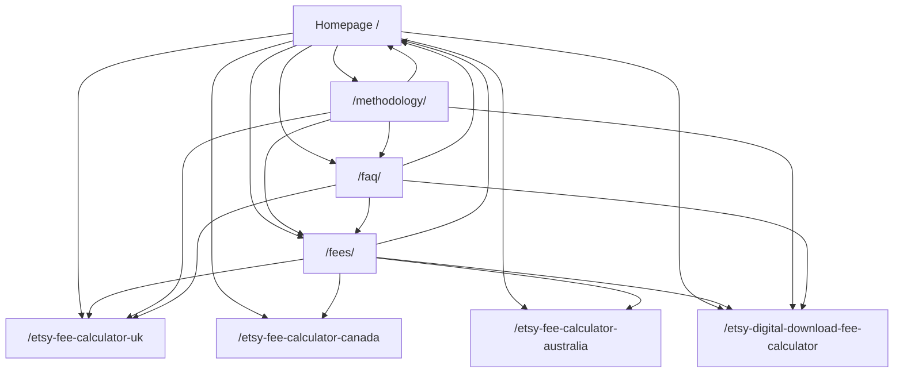

# Step 22 — ShopProfit SEO & Keyword Comprehensive Audit

## 1. Executive Summary & Audit Baseline
This audit is a strictly **READ-ONLY** inspection of the live production website (`https://shopprofitcalculator.com/`), its static HTML builds, HTTP response headers, crawlability signals, search intent alignment, keyword potential, and internal linking structure.

**Key Findings:**
1. **Critical H1 Duplication:** All calculator pages (Homepage, UK, Canada, Australia, Digital) share the exact identical `<h1>` tag: `"KNOW WHAT YOU KEEP."` (brand slogan), while the true descriptive topic heading is suppressed to an `<h2>`.
2. **Severe Internal Duplication (97%+ Content Overlap):** Regional and digital pages clone `index.html` almost verbatim (~1,880 out of ~1,930 words are identical), posing severe cannibalization and thin-content risks under Google's helpful content systems.
3. **Primary Intent Mismatch:** `/etsy-fee-calculator` (the highest-volume keyword intent in the entire niche) 301-redirects to `/fees/`, but `/fees/` has **no interactive calculator**; it is an informational text guide with a CTA linking back to `/#calculator`.
4. **Technical Inconsistencies:** Dual HTTP 200 responses on slash vs non-slash paths (e.g. `/fees` and `/fees/`), mixed sitemap trailing-slash conventions, and missing `X-Robots-Tag: noindex` on the preview domain `https://shopprofitcalculator.pages.dev/`.
5. **Production Safety Maintained:** Zero production changes made. Pages deployment `681f4e6b`, Worker deployment `73858135-0a40-4eef-befa-4187e65534d0`, D1 database `shopprofit-fees-db`, active version `v1.1.1`, and DNS remain 100% untouched.

---

## 2. Complete Inventory of Indexable Pages

The table below records all 11 indexable URLs discovered via sitemap and site structure:

| URL | Title | Meta Description | H1 Heading | Canonical | Robots | Word Count | Primary Topic | Search Intent |
|---|---|---|---|---|---|---|---|---|
| `https://shopprofitcalculator.com/` | Etsy Profit Calculator — Fees, Costs & Net Profit \| ShopProfit | Calculate Etsy fees, product costs, shipping, Offsite Ads, profit margin and break-even price instantly with ShopProfit. | `KNOW WHAT YOU KEEP.` | `https://shopprofitcalculator.com/` | index, follow | ~1,913 | Etsy profit & fee calculator | Tool / Calculator |
| `https://shopprofitcalculator.com/fees/` | Etsy Fees Calculator & Complete Seller Fees Guide \| ShopProfit | Complete guide to Etsy seller fees: 6.5% transaction fee, $0.20 listing fee, payment processing by country, regulatory fees, Offsite Ads, and worked examples. | `Etsy Fees Calculator & Complete Etsy Seller Fees Guide` | `https://shopprofitcalculator.com/fees/` | index, follow | ~1,988 | Official Etsy fee policies, schedules & worked examples | Informational |
| `https://shopprofitcalculator.com/methodology/` | Etsy Profit Calculator Methodology \| How ShopProfit Calculates Profit | Transparent explanation of how ShopProfit estimates Etsy fees, net profit, profit margin, break-even price, and target pricing using integer-precision formulas. | `How ShopProfit Estimates Etsy Take-Home & Net Profit` | `https://shopprofitcalculator.com/methodology/` | index, follow | ~741 | Calculation algorithms, formulas, and data provenance | Informational / Trust |
| `https://shopprofitcalculator.com/faq/` | Etsy Profit Calculator FAQ – Etsy Fees & Profit Questions \| ShopProfit | Direct, accurate answers to common questions about Etsy seller fees, payment processing, shipping deductions, profit margins, break-even prices, and ShopProfit. | `Etsy Profit Calculator FAQ` | `https://shopprofitcalculator.com/faq/` | index, follow | ~749 | Common seller questions regarding fees and profits | Informational |
| `https://shopprofitcalculator.com/etsy-fee-calculator-uk` | Etsy Fee Calculator UK — ShopProfit | Estimate Etsy fees and take-home profit in GBP for UK sellers, including payment processing and the UK regulatory operating fee. | `KNOW WHAT YOU KEEP.` *(Issue)* | `https://shopprofitcalculator.com/etsy-fee-calculator-uk` | index, follow | ~1,932 | UK Etsy seller fee calculation (GBP, 4% + £0.20, 0.48% DST) | Tool / Calculator |
| `https://shopprofitcalculator.com/etsy-fee-calculator-canada` | Etsy Fee Calculator Canada — ShopProfit | Estimate Etsy fees and seller profit in CAD for Canadian shops, including Canadian processing and the 0.50% regulatory operating fee. | `KNOW WHAT YOU KEEP.` *(Issue)* | `https://shopprofitcalculator.com/etsy-fee-calculator-canada` | index, follow | ~1,931 | Canadian Etsy seller fee calculation (CAD, 3%/4% + $0.25, 0.50% DST) | Tool / Calculator |
| `https://shopprofitcalculator.com/etsy-fee-calculator-australia` | Etsy Fee Calculator Australia — ShopProfit | Estimate Etsy fees and take-home profit in AUD for Australian sellers, with Australian payment-processing assumptions and local fee estimates. | `KNOW WHAT YOU KEEP.` *(Issue)* | `https://shopprofitcalculator.com/etsy-fee-calculator-australia` | index, follow | ~1,923 | Australian Etsy seller fee calculation (AUD, 3%/4% + $0.25) | Tool / Calculator |
| `https://shopprofitcalculator.com/etsy-digital-download-fee-calculator` | Etsy Digital Download Fee Calculator — ShopProfit | Estimate Etsy fees and profit for a digital download. Set physical production and packaging costs to zero and calculate your take-home. | `KNOW WHAT YOU KEEP.` *(Issue)* | `https://shopprofitcalculator.com/etsy-digital-download-fee-calculator` | index, follow | ~1,939 | Etsy digital printable/download fee calculation ($0 physical cost) | Tool / Calculator |
| `https://shopprofitcalculator.com/privacy` | Privacy Notice \| ShopProfit | ShopProfit privacy notice: learn what calculator data stays in your browser, which preferences are stored, and what happens when you share a report. | `Privacy notice` | `https://shopprofitcalculator.com/privacy` | index, follow | ~308 | Privacy policy & client-side data storage details | Utility / Legal |
| `https://shopprofitcalculator.com/terms` | Terms of Use \| ShopProfit | Terms of use for ShopProfit, a browser-based Etsy fees, pricing, margin, and profit calculator. | `Terms of use` | `https://shopprofitcalculator.com/terms` | index, follow | ~298 | Legal terms & independent liability disclaimer | Utility / Legal |
| `https://shopprofitcalculator.com/contact` | Contact ShopProfit | Contact the ShopProfit team about the Etsy fee and profit calculator, privacy, or site content. | `Contact ShopProfit` | `https://shopprofitcalculator.com/contact` | index, follow | ~29 | Operator contact & feedback channel | Utility / Contact |

---

## 3. Internal Duplicate Content Audit

### A. High Duplication Risk: Regional & Digital Clones vs. Homepage
- **Mechanism:** In `scripts/generate-seo-pages.mjs`, each page (`etsy-fee-calculator-uk.html`, `etsy-fee-calculator-canada.html`, `etsy-fee-calculator-australia.html`, `etsy-digital-download-fee-calculator.html`) is created by copying `base` (the entire `index.html`) and swapping:
  1. `<title>` and `<meta name="description">`
  2. Hero eyebrow text
  3. `<h2 id="calculator-heading">`
  4. One short introductory sentence
  5. Exactly one FAQ item
- **Overlap:** Out of ~1,930 words, **over 1,880 words (97.4%)** are verbatim clones of `index.html`:
  - Identical 62-country table
  - Identical "How Etsy fees vary by country" section
  - Identical "How much does Etsy take from a sale?" section
  - Identical "How ShopProfit calculates profit" section
  - Identical "Etsy Pricing, Break-Even & Fee Strategy" section
  - 11 identical FAQ questions and answers
- **H1 Identity:** All four subpages retain the homepage `<h1>KNOW WHAT YOU KEEP.</h1>`.
- **Verdict:** **HIGH DUPLICATION RISK.** Google's modern spam/helpful-content filters frequently classify near-identical cloned pages as programmatic doorway pages or consolidate ranking signals onto the homepage.

### B. Medium Duplication Risk: FAQ Page vs. Homepage
- The 12 FAQ questions on `/faq/` are identical to the 12 FAQ questions embedded in the homepage accordion.
- While common in single-page designs, having the identical FAQ schema on both `/` and `/faq/` divides structured-data signals.

---

## 4. Search Intent Audit

| Target Query / Concept | Primary Search Intent | Assigned Page | Intent Match Evaluation |
|---|---|---|---|
| **Etsy Fee Calculator** | **Tool / Calculator** | Currently 301 redirected from `/etsy-fee-calculator` to `/fees/` | **MISMATCH (Critical):** Users seeking an interactive calculator land on an informational guide. To calculate fees, they must click an external link back to `/#calculator`. |
| **Etsy Profit Calculator** | **Tool / Calculator** | Homepage (`/`) | **MATCH:** Direct interactive calculator with revenue, production costs, shipping, and net profit. |
| **Etsy Pricing Calculator / Break-Even Calculator** | **Tool / Calculator** | Homepage (`/#target-pricing`, `/#break-even-tool`) | **PARTIAL MATCH:** Functionality exists on the homepage, but query URLs (`/etsy-pricing-calculator`, `/etsy-break-even-calculator`) redirect to URL fragments which search engines drop. |
| **Etsy Seller Fees Guide / Breakdown** | **Informational** | `/fees/` | **EXCELLENT MATCH:** Comprehensive, authoritative breakdown of listing, transaction, processing, regulatory, and advertising fees. |
| **Etsy Fee Calculator UK** | **Tool / Calculator** | `/etsy-fee-calculator-uk` | **PARTIAL MATCH:** Calculator pre-selects UK (£ GBP, 4% + £0.20, 0.48% DST), but 97% of page body discusses US and global rules instead of UK seller context (VAT on fees, HMRC threshold, Royal Mail). |
| **Etsy Digital Download Fees** | **Tool / Calculator** | `/etsy-digital-download-fee-calculator` | **PARTIAL MATCH:** Zeroes out shipping and production costs, but page body contains physical manufacturing and shipping advice rather than digital listing auto-renewal rules. |

---

## 5. Keyword Opportunity Matrix

*Note: Per strict instructions, search volumes are not guessed without direct API access.*

| Keyword | Intent | Relevant ShopProfit Page | Demand Evidence | Competition / Difficulty | Opportunity | Action Required |
|---|---|---|---|---|---|---|
| `etsy fee calculator` | Tool | `/` or `/fees/` | Primary market head term | High (eRank, SaleCalc, Alura) | Highest | Align route so the calculator tool directly serves this primary query. |
| `etsy profit calculator` | Tool | `/` | High secondary head term | Medium-High | High | Retain on homepage; optimize H1 and hero copy. |
| `etsy pricing calculator` | Tool | `/#target-pricing` | Consistent seller demand | Medium | High | Expose target pricing tool clearly; do not hide behind anchor redirect. |
| `etsy break even calculator` | Tool | `/#break-even-tool` | High intent, lower volume | Low-Medium | High | Emphasize break-even solver as a standalone feature. |
| `etsy seller fees` | Informational | `/fees/` | Core guide term | Medium | High | `/fees/` already matches; maintain fee freshness and schema. |
| `etsy fee calculator uk` | Tool (Geo) | `/etsy-fee-calculator-uk` | Strong regional volume | Medium | High | Fix H1, replace cloned text with UK-specific VAT/shipping guidance. |
| `etsy fee calculator canada` | Tool (Geo) | `/etsy-fee-calculator-canada` | Strong regional volume | Low-Medium | High | Fix H1, replace cloned text with Canada domestic vs. US order guidance. |
| `etsy fee calculator australia` | Tool (Geo) | `/etsy-fee-calculator-australia` | Moderate regional volume | Low-Medium | High | Fix H1, replace cloned text with Australia GST & domestic rate guidance. |
| `etsy digital download fees` | Tool / Info | `/etsy-digital-download-fee-calculator` | Rapidly growing niche | Low-Medium | Very High | Fix H1, write digital-specific guidance on multi-quantity fee deductions. |
| `etsy regulatory operating fee` | Informational | `/fees/` | Specialized technical term | Very Low | High | Add dedicated subsection on `/fees/` detailing the 9 DST countries. |

### Keyword Categorization:
- **Group A (Existing pages needing optimization):**
  - `/etsy-fee-calculator-uk` (fix H1 and eliminate 97% boilerplate clone)
  - `/etsy-fee-calculator-canada` (fix H1 and localize)
  - `/etsy-fee-calculator-australia` (fix H1 and localize)
  - `/etsy-digital-download-fee-calculator` (fix H1 and specialize for digital sellers)
  - `/fees/` (either embed interactive calculator or clarify relationship with `/`)
- **Group B (Existing pages matching intent):**
  - `/` (Etsy Profit Calculator)
  - `/methodology/` (How ShopProfit calculates profit & fee formulas)
  - `/faq/` (Etsy seller fee FAQs)
- **Group C (Potential future pages — strictly restricted per Step 11):**
  - Future: `Etsy Offsite Ads Calculator & Guide` (only if distinct, non-thin tool page)
- **Group D (Keywords that MUST NOT be targeted):**
  - Mass programmatic country pages (e.g. `etsy fee calculator turkey`, `etsy fee calculator vietnam`, etc.)
  - Navigational terms (`etsy login`, `etsy seller dashboard`)
  - Irrelevant tools (`etsy tag generator`, `etsy banner maker`)

---

## 6. Google Search Console & Indexing Reality

- **Direct GSC Connection Status:** Not connected / no service account API available in workspace.
- **Strict Rule:** **ZERO fabricated metrics.** No impressions, clicks, or ranking positions are invented.
- **What Can Be Publicly Verified:**
  - `robots.txt` is accessible and permits all user-agents (`Allow: /`).
  - `sitemap.xml` is accessible at `https://shopprofitcalculator.com/sitemap.xml`.
  - Canonical tags are present on every HTML page.
  - No `noindex` directives exist on production apex pages.
  - Live HTTPS and security headers are active and valid.
- **What Requires Human GSC Access:**
  - Exact indexation status (whether Google has indexed the 4 regional clones or marked them "Duplicate, Google chose different canonical").
  - Organic impressions, click-through rates, and average query positions.
  - Crawl budget stats and mobile rendering snapshots.

---

## 7. Technical SEO Audit

| Check | Production Reality | Status | Notes |
|---|---|---|---|
| **robots.txt** | `Allow: /`, declares `sitemap.xml` | **PASS** | Valid syntax, accessible via HTTPS. |
| **sitemap.xml** | Lists 11 URLs | **WARNING** | Inconsistent trailing slashes: `/fees/` has trailing slash, `/etsy-fee-calculator-uk` does not. |
| **Trailing Slash Handling** | Both `/fees` and `/fees/` return HTTP 200 | **WARNING** | Cloudflare Pages serves both without 301 redirection between them. |
| **HTTP to HTTPS Redirect** | `http://` 301 redirects to `https://` | **PASS** | Strict transport enforced. |
| **WWW to Apex Redirect** | `https://www.` 301 redirects to apex | **PASS** | Normalizes domain authority. |
| **pages.dev Domain** | `https://shopprofitcalculator.pages.dev/` returns 200 | **WARNING** | Canonical points to apex, but missing `X-Robots-Tag: noindex, nofollow` header on `*.pages.dev`. |
| **404 Error Handling** | Nonexistent URL returns clean HTTP 404 | **PASS** | No soft 404s. |
| **Mobile Viewport** | `width=device-width, initial-scale=1` | **PASS** | Mobile responsive. |
| **Security Headers** | HSTS, nosniff, DENY, Permissions-Policy | **PASS** | Production grade. |
| **Structured Data** | Valid JSON-LD on all pages | **PASS** | Organization, WebSite, WebApplication, Breadcrumbs, FAQPage. |

---

## 8. Internal Linking & Crawl Hierarchy

### Linking Discrepancies Found:
1. **Asymmetric Footer Linking:** On `/methodology/` and `/faq/`, only UK and Digital are linked in the resource links; Canada (`/etsy-fee-calculator-canada`) and Australia (`/etsy-fee-calculator-australia`) are missing.
2. **Anchor Redirect Fragmentation:** Homepage links to target pricing and break-even tools point to `/#target-pricing` and `/#break-even-tool`, while `_redirects` also redirects `/etsy-pricing-calculator -> /#target-pricing`. Search engines ignore the `#hash` portion and treat the destination simply as `/`.

---

## 9. Content Quality & Thin-Content Risks

1. **Brand Slogan Usurping H1:**
   `<h1 class="logo-text">KNOW WHAT YOU KEEP.</h1>` is hardcoded across all templates. Google's parser interprets this as the primary page topic rather than the keyword-rich topic (e.g. `Etsy Fee Calculator UK`).
2. **Programmatic Clone Fatigue:**
   The regional pages are virtually indistinguishable from each other and the homepage. They do not yet offer unique regional value such as:
   - UK: How VAT affects the 6.5% transaction fee and payment processing.
   - Canada: How domestic orders (3%) differ from international sales (4%) and Canadian GST/HST.
   - Australia: GST on seller fees and overseas buyer currency conversions.
   - Digital: Listing auto-renewal nuances when selling multiple digital copies ($0.20 per unit sold).
3. **Contact Page:**
   `/contact` has only 29 words. It fulfills basic legal presence but does not project high organizational authoritativeness.

---

## 10. Prioritized Action Matrix (Top 10 Actions)

| Priority | Issue / Opportunity | Expected Impact | Implementation Risk | Recommended Action |
|---|---|---|---|---|
| **P0** | **Repeated Brand Slogan H1 on Regional Pages** | High | Low | Change `<h1 class="logo-text">` to a header/logo element and promote the page topic (`<h2 id="calculator-heading">`) to the true `<h1>`. |
| **P0** | **Intent Mismatch on `/etsy-fee-calculator`** | High | Low | Embed a lightweight interactive calculator directly on `/fees/` or realign `/etsy-fee-calculator` to an interactive calculator template. |
| **P1** | **97% Duplicate Content on Regional Pages** | Very High | Low | Replace copied boilerplate sections on UK, Canada, Australia, and Digital pages with genuinely unique, localized advice. |
| **P1** | **Trailing-Slash Inconsistency & Dual 200 Serving** | Medium | Low | Standardize sitemap and canonical URLs (either all trailing-slash or all non-trailing-slash) and configure 301 redirects. |
| **P1** | **Missing `X-Robots-Tag: noindex` on `pages.dev`** | Medium | Low | Add `_headers` rule targeting `*.pages.dev` with `X-Robots-Tag: noindex, nofollow` to prevent duplicate indexing of Cloudflare preview URLs. |
| **P2** | **Duplicate FAQPage Schema Across Pages** | Medium | Low | Restrict global FAQ schema to `/faq/` and provide only localized, context-specific FAQs on regional and digital pages. |
| **P2** | **Asymmetric Internal Linking in Footers** | Low-Medium | Low | Add Canada and Australia links to `/methodology/` and `/faq/` resource blocks. |
| **P2** | **Fragment-based 301 Redirects** | Low-Medium | Low | Transition query redirects like `/etsy-pricing-calculator` to clean dedicated sections or dedicated query-focused tools. |
| **P3** | **Thin `/contact` Page Content** | Low | Low | Expand contact page with support response expectations and operator context. |
| **P3** | **Strict Rejection of Thin Mass Country Pages** | High (Defensive) | Zero | DO NOT create 58 thin country pages; keep focus on the top 4 international markets and ensure they are high quality. |

---

## 11. Strict Policy on New Pages

Per Step 11 instructions:
1. **NO NEW PAGES ARE TO BE CREATED AT THIS TIME.**
2. Mass programmatic creation of thin country pages (e.g., generating pages for 58 remaining markets) is **explicitly rejected**. Generating 58 additional 97%-duplicate pages would trigger automated spam/helpful content demotions across the entire domain.
3. Optimization of existing regional pages (`UK`, `Canada`, `Australia`) and `/fees/` must be completed and proven before any new page is considered.

---

## 12. Production Safety Invariants

The following production invariants were verified unchanged throughout this read-only audit:
- **Cloudflare Pages:** Deployment `681f4e6b` — **UNCHANGED**
- **Cloudflare Worker:** Deployment `73858135-0a40-4eef-befa-4187e65534d0` — **UNCHANGED**
- **Cloudflare D1 Database:** `shopprofit-fees-db` — **UNCHANGED** (zero writes)
- **Cloudflare DNS:** **UNCHANGED**
- **Cloudflare Cron:** `0 8 * * *` — **UNCHANGED**
- **Active Fee Release:** `v1.1.1` — **UNCHANGED**
- **Calculator Logic & Fees Engine:** **UNCHANGED**
